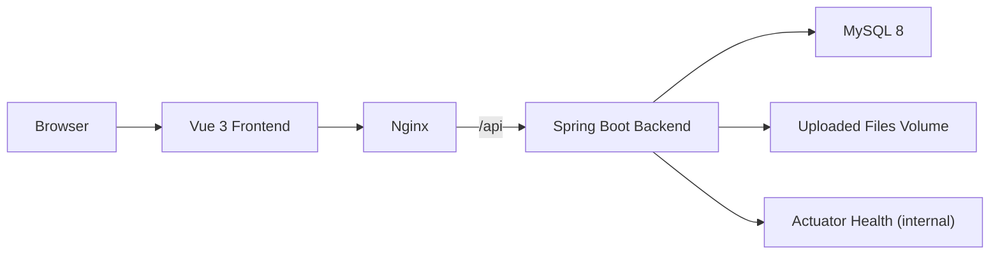
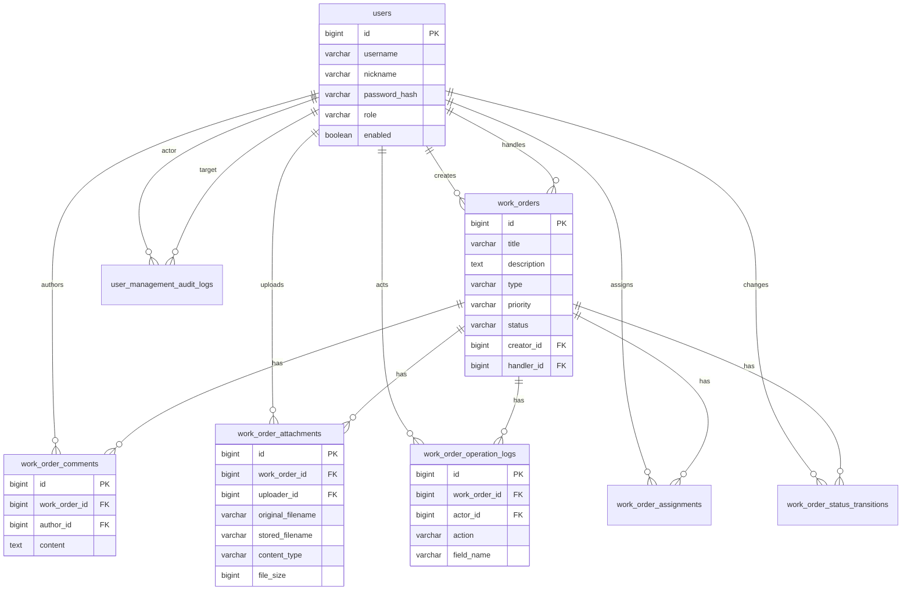
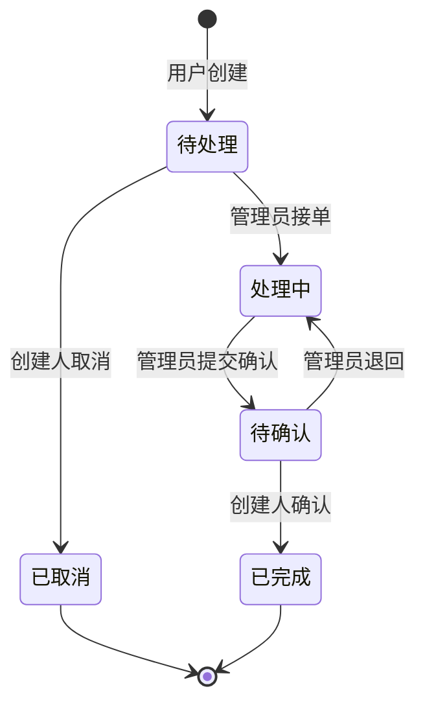

# Work Order System

一个面向内部支持/运维场景的工单管理系统。项目包含 Vue 前端、Spring Boot 后端、MySQL 数据库、Flyway 数据库迁移、自动化测试和 Docker Compose 部署配置。

本项目定位为学习和面试展示用的完整业务闭环系统，不宣称真实生产用户规模或性能指标。

## 功能介绍

- 用户注册、登录、退出、查看当前登录状态。
- 用户资料维护和密码修改。
- 普通用户创建、查看、修改、取消自己的工单。
- 管理员查看管理页、查看全部工单、筛选工单、查看统计信息。
- 管理员管理用户状态和角色。
- 管理员分配处理人、接单、提交确认、退回处理中。
- 普通用户确认完成。
- 工单详情包含操作日志、评论、附件列表、附件上传和下载。
- 基于角色和资源归属控制列表、详情、评论、附件和状态操作权限。
- 对注册、登录、工单、评论、附件、分页等典型参数做校验。
- 后端包含 CSRF 防护、登录失败限流、会话刷新、统一异常响应等基础安全措施。

## 技术栈

| 层级 | 技术 |
| --- | --- |
| 前端 | Vue 3, TypeScript, Vite, Element Plus |
| 后端 | Java 21, Spring Boot 3, Spring MVC, JDBC, Bean Validation |
| 数据库 | MySQL 8, Flyway |
| 安全 | BCrypt 密码哈希, Session 登录态, CSRF Token, 登录失败限流 |
| 测试 | JUnit 5, Spring Boot Test, H2, Vitest, Vue Test Utils |
| 部署 | Docker, Docker Compose, Nginx |

## 系统架构



Docker 部署时，只有 Nginx 前端端口暴露到宿主机；后端和 MySQL 在 Compose 网络中独立运行。后端健康检查只在 Docker 内部使用，不通过 Nginx 对外暴露。

## 数据库关系图



## 核心业务流程

### 工单流转



### 典型使用路径

1. 普通用户注册并登录。
2. 用户创建工单，填写标题、描述、类型、优先级。
3. 管理员在管理页查看工单，可以筛选、分配处理人、接单。
4. 管理员处理完成后提交确认。
5. 用户查看详情、评论、附件和日志，确认完成或在允许状态下继续沟通。
6. 系统记录关键操作日志，便于追踪工单历史。

## 本地启动说明

本地开发方式适合调试代码，使用宿主机 MySQL。

### 依赖

- Java 21
- Maven
- Node.js 22 或兼容版本
- MySQL 8

### 创建数据库

```sql
CREATE DATABASE IF NOT EXISTS work_order_system
  DEFAULT CHARACTER SET utf8mb4
  DEFAULT COLLATE utf8mb4_unicode_ci;
```

### 配置后端环境变量

PowerShell 示例：

```powershell
$env:WORK_ORDER_DB_URL='jdbc:mysql://localhost:3306/work_order_system?useUnicode=true&characterEncoding=utf8&serverTimezone=Asia/Shanghai'
$env:WORK_ORDER_DB_USERNAME='root'
$env:WORK_ORDER_DB_PASSWORD='你的本机 MySQL 密码'
$env:WORK_ORDER_BOOTSTRAP_ADMIN_TOKEN='只在本机临时使用的管理员初始化令牌'
```

### 启动后端

```powershell
cd D:\CodexWork\projects\work-order-system\backend
mvn spring-boot:run
```

后端健康检查：

```text
http://localhost:8080/api/system/status
http://localhost:8080/api/system/database
```

### 启动前端

```powershell
cd D:\CodexWork\projects\work-order-system\frontend
npm.cmd install
npm.cmd run dev
```

本地开发访问地址：

```text
http://localhost:5173
```

## Docker 部署说明

Docker 方式适合一键启动完整环境，包含 Nginx 前端、Spring Boot 后端、MySQL 8。

### 首次配置

```powershell
cd D:\CodexWork\projects\work-order-system
Copy-Item .env.example .env
```

编辑 `.env`，至少修改以下值：

```text
WORK_ORDER_CONTAINER_DB_PASSWORD=改成你自己的应用数据库密码
WORK_ORDER_CONTAINER_DB_ROOT_PASSWORD=改成你自己的 root 密码
WORK_ORDER_BOOTSTRAP_ADMIN_TOKEN=改成一次性管理员初始化令牌
```

`.env` 是本机私有文件，不要提交到 Git。

### 启动

```powershell
docker compose up -d --build
```

访问地址：

```text
http://localhost:8088
```

查看状态：

```powershell
docker compose ps
```

### 停止

```powershell
docker compose down
```

不要随意执行 `docker compose down -v`，因为 `-v` 会删除 Docker 中的 MySQL 数据卷和上传文件卷。

更多备份、恢复和端口说明见 [deploy/README.md](deploy/README.md)。

## 测试说明

后端完整测试：

```powershell
cd D:\CodexWork\projects\work-order-system\backend
mvn test
```

前端完整测试：

```powershell
cd D:\CodexWork\projects\work-order-system\frontend
npm.cmd run test
```

当前已验证结果：

- 后端：115 个测试通过，0 失败，0 错误，0 跳过。
- 前端：41 个测试通过。

测试重点覆盖注册登录、普通用户/管理员权限、工单创建修改、工单查看权限、状态流转、分配处理人、评论附件权限、参数校验和典型异常情况。

## 默认测试账号的安全创建方式

项目不在代码或迁移脚本中硬编码默认账号密码。

推荐方式：

1. 设置 `WORK_ORDER_BOOTSTRAP_ADMIN_TOKEN`。
2. 通过管理员初始化接口创建首个管理员。
3. 创建完成后更换或移除初始化令牌。
4. 后续普通用户通过注册页面创建，管理员可在管理页调整角色和启用状态。

接口示例：

```http
POST /api/auth/bootstrap-admin
X-Bootstrap-Token: 你的初始化令牌
Content-Type: application/json

{
  "username": "admin",
  "nickname": "管理员",
  "password": "StrongPassword123",
  "confirmPassword": "StrongPassword123"
}
```

密码只存储 BCrypt 哈希，不应在 README、`.env.example` 或提交历史中写真实密码。

## API 文档入口

当前项目没有集成 Swagger UI。接口入口以代码和本文档为准：

- 健康检查：`GET /api/system/status`
- 数据库检查：`GET /api/system/database`
- 认证：`/api/auth/**`
- 普通工单：`/api/work-orders/**`
- 管理端：`/api/admin/**`

主要接口：

| 模块 | 方法和路径 | 说明 |
| --- | --- | --- |
| Auth | `GET /api/auth/csrf` | 获取 CSRF token |
| Auth | `POST /api/auth/register` | 注册 |
| Auth | `POST /api/auth/bootstrap-admin` | 初始化首个管理员 |
| Auth | `POST /api/auth/login` | 登录 |
| Auth | `GET /api/auth/me` | 当前用户 |
| Auth | `PATCH /api/auth/profile` | 修改资料 |
| Auth | `POST /api/auth/password` | 修改密码 |
| Auth | `POST /api/auth/logout` | 退出 |
| Work Orders | `GET /api/work-orders` | 当前用户可见工单列表 |
| Work Orders | `POST /api/work-orders` | 创建工单 |
| Work Orders | `GET /api/work-orders/{id}` | 工单详情 |
| Work Orders | `PUT /api/work-orders/{id}` | 修改工单 |
| Work Orders | `POST /api/work-orders/{id}/cancel` | 取消工单 |
| Work Orders | `POST /api/work-orders/{id}/confirm` | 确认完成 |
| Comments | `GET /api/work-orders/{id}/comments` | 评论列表 |
| Comments | `POST /api/work-orders/{id}/comments` | 添加评论 |
| Comments | `DELETE /api/work-orders/{id}/comments/{commentId}` | 删除评论 |
| Attachments | `GET /api/work-orders/{id}/attachments` | 附件列表 |
| Attachments | `POST /api/work-orders/{id}/attachments` | 上传附件 |
| Attachments | `GET /api/work-orders/{id}/attachments/{attachmentId}/download` | 下载附件 |
| Admin | `GET /api/admin/users` | 用户列表 |
| Admin | `PUT /api/admin/users/{id}/enabled` | 启用/禁用用户 |
| Admin | `PUT /api/admin/users/{id}/role` | 修改角色 |
| Admin | `GET /api/admin/work-orders` | 管理员工单列表 |
| Admin | `GET /api/admin/work-orders/statistics` | 工单统计 |
| Admin | `GET /api/admin/handlers` | 可分配处理人列表 |
| Admin | `PUT /api/admin/work-orders/{id}/handler` | 分配处理人 |
| Admin | `PUT /api/admin/work-orders/{id}/accept` | 接单 |
| Admin | `PUT /api/admin/work-orders/{id}/submit` | 提交确认 |
| Admin | `PUT /api/admin/work-orders/{id}/return` | 退回处理中 |

所有非 GET/HEAD/OPTIONS 的 `/api/**` 请求都需要带 `X-CSRF-Token`。

## 页面截图清单

建议在最终交付时保存到 `docs/screenshots/`：

- 登录页：`docs/screenshots/01-login.png`
- 注册页：`docs/screenshots/02-register.png`
- 普通用户工单列表：`docs/screenshots/03-user-work-orders.png`
- 工单详情：`docs/screenshots/04-work-order-detail.png`
- 评论和附件区域：`docs/screenshots/05-comments-attachments.png`
- 个人资料页：`docs/screenshots/06-profile.png`
- 管理员首页/统计：`docs/screenshots/07-admin-dashboard.png`
- 管理员用户管理：`docs/screenshots/08-admin-users.png`
- 管理员工单管理：`docs/screenshots/09-admin-work-orders.png`

当前仓库不附带截图文件，避免提交与实际页面不一致的静态图片。

## 已知限制

- 当前认证基于服务端 Session，适合单体部署；多实例部署需要共享 Session 或改造认证方案。
- 文件上传已限制大小和权限，但还可以继续增强文件魔数校验、病毒扫描和对象存储接入。
- API 文档尚未自动生成，后续可接入 springdoc-openapi。
- 列表分页使用常规分页，极大数据量下可继续优化为游标分页或组合索引查询。
- 统计查询仍有进一步合并和缓存空间。
- 前端当前是单页应用原型，复杂权限和表单可以继续拆分组件。

## 后续可扩展方向

- 接入 OpenAPI/Swagger UI，生成接口文档。
- 增加邮件、站内信或 WebSocket 通知。
- 增加工单 SLA、超时提醒和优先级规则。
- 增加多部门、多角色、工单分类字典。
- 附件迁移到对象存储，并增加预览能力。
- 增加审计日志查询页和导出功能。
- 引入 Redis 做登录限流、缓存和分布式 Session。
- 增加 CI 流水线，自动运行后端和前端测试。

## 面试准备

面试讲解稿、常见追问和参考答案见 [docs/interview-prep.md](docs/interview-prep.md)。
